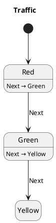

# PlantUML ジェネレーター

PlantUML ジェネレーターは `.yaml` ステートマシン定義を読み込み、マシンごとに1つの `.puml` ステートダイアグラムを出力します。

---

## セットアップ

```kotlin
monakaPumlGenerator {
    pumlOutputDir.set(layout.buildDirectory.dir("monaka-puml"))
}
```

---

## 実行方法

```bash
./gradlew generateMonakaYaml
./gradlew generateMonakaPuml
```

---

## 手動編集 vs. 自動生成 YAML

同じマシンに手動編集された `Machine.yaml` と自動生成された `Machine.gen.yaml` の両方が存在する場合、`generateMonakaPuml` は手動編集の `.yaml` ファイルを使用します。

---

## 出力フォーマット



---

## ダイアグラム規約

### 説明行

```
StateName : trigger → target ◆ Effect1, Effect2
```

| シンボル | 意味 |
|---|---|
| `→` | ステート遷移ターゲット。 |
| `◆` | 1つ以上のサイドエフェクトが発行される。 |
| `▶` | 非同期タスクが起動される。 |

---

## ダイアグラムのレンダリング

**IntelliJ IDEA / Android Studio** — [PlantUML Integration](https://plugins.jetbrains.com/plugin/7017-plantuml-integration) プラグインをインストール。

**VS Code** — [PlantUML](https://marketplace.visualstudio.com/items?itemName=jebbs.plantuml) 拡張機能をインストールし、`Alt+D` でプレビュー。

**CLI**

```bash
brew install plantuml
plantuml build/monaka-puml/*.puml
```
