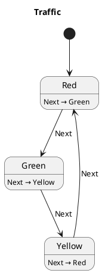

# PlantUML Generator

The PlantUML generator scans Kotlin source files for `stateMachine { }` DSL blocks and emits one
`.puml` state diagram per machine. The diagrams can be rendered by any PlantUML-compatible tool
(IntelliJ plugin, VS Code extension, `plantuml` CLI, or the online server).

---

## Setup

Apply the Monaka Gradle plugin and configure the same `monakaYamlExport` extension used by the
[YAML generator](yaml-generator.md):

```kotlin
// build.gradle.kts
plugins {
    id("dev.gmvalentino.monaka")
}

monakaYamlExport {
    // Files to scan — adjust the glob to match your source sets.
    sources.setFrom(fileTree("src/commonMain/kotlin") { include("**/*.kt") })

    // Where .yaml files are written. Default: build/monaka-yaml
    outputDir.set(layout.buildDirectory.dir("monaka-yaml"))

    // Where .puml files are written. Defaults to outputDir if not set.
    pumlOutputDir.set(layout.buildDirectory.dir("monaka-puml"))
}
```

`pumlOutputDir` is independent of `outputDir` — you can write diagrams to a `docs/diagrams`
folder while keeping the YAML files in `build/`.

---

## Running

```bash
./gradlew generateMonakaPuml
```

One `.puml` file is written to `pumlOutputDir` for every `stateMachine { }` block found in the
configured sources. The task is cacheable — it re-runs only when input sources change.

---

## Output format

The emitter writes standard PlantUML state diagram syntax. For the state machine below:

```kotlin
val machine = stateMachine<TrafficState, TrafficAction, TrafficEffect> {
    initialState(TrafficState.Red)
    state<TrafficState.Red> {
        on<TrafficAction.Next> { transition(TrafficState.Green) }
    }
    state<TrafficState.Green> {
        on<TrafficAction.Next> { transition(TrafficState.Yellow) }
    }
    state<TrafficState.Yellow> {
        on<TrafficAction.Next> { transition(TrafficState.Red) }
    }
}
```

The generator produces `Traffic.puml`:



---

## Diagram conventions

### Description lines

Description lines carry behaviour detail and use the format:

```
StateName : trigger → target ◆ Effect1, Effect2
```

| Symbol | Meaning |
|---|---|
| `→` | State transition target. |
| `◆` | One or more side effects emitted. |
| `▶` | Async task launched (e.g. `▶ task(login, autoCancel){ LoginSucceeded | LoginFailed }`). |

### Arrows

Arrows carry routing only — effects and tasks are omitted from the arrow label to keep the
diagram readable.

```
State --> Target : Trigger
```

`onEnter` hooks that perform an **immediate** transition use a dashed arrow to indicate the
transition happens on entry before any action is dispatched:

```
State -[dashed]-> Target : onEnter
```

`onEnter` hooks that launch a **task** emit a description line only — no arrow — because the
transition happens later when the task dispatches an action.

### Flat vs. composite layout

The emitter selects a layout based on whether any states act as catch-alls (parent sealed types
that are never transition targets themselves):

**Flat layout** — all states are direct transition targets; each state is a top-level node.

**Composite layout** — catch-all states are rendered as PlantUML composite states that wrap all
leaf states. This mirrors sealed interface hierarchies where a parent `state<MyState>` block
handles actions not matched by any substate:

```plantuml
state "Auth" as Auth {
  Auth : Logout → Idle

  state "Auth.SignedOut" as Auth.SignedOut
  Auth.SignedOut : Login → Auth.SigningIn
  Auth.SignedOut --> Auth.SigningIn : Login

  state "Auth.SigningIn" as Auth.SigningIn
}
```

### Lifecycle hooks

Lifecycle hooks (`onPause`, `onResume`, `onStart`, `onStop`, etc.) that produce a transition
get both a description line and a solid arrow:

```
State : onPause → BackgroundState
State --> BackgroundState : onPause
```

---

## Rendering the diagrams

**IntelliJ IDEA / Android Studio** — install the [PlantUML Integration](https://plugins.jetbrains.com/plugin/7017-plantuml-integration) plugin. Open any `.puml` file to see a live preview.

**VS Code** — install the [PlantUML](https://marketplace.visualstudio.com/items?itemName=jebbs.plantuml) extension and press `Alt+D` to preview.

**CLI**

```bash
# Install via Homebrew (macOS)
brew install plantuml

# Render all .puml files in the output directory to .png
plantuml build/monaka-puml/*.puml
```
