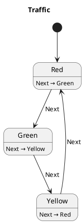

# PlantUML Generator

The PlantUML generator reads `.yaml` state machine definitions and emits one `.puml` state
diagram per machine. The diagrams can be rendered by any PlantUML-compatible tool (IntelliJ
plugin, VS Code extension, `plantuml` CLI, or the online server).

The recommended workflow is to run `generateMonakaYaml` first (to produce `.yaml` files from
your DSL), optionally edit those files, then run `generateMonakaPuml` to produce the diagrams.

---

## Setup

Apply the Monaka Gradle plugin and configure the two generator extensions:

```kotlin
// build.gradle.kts
plugins {
    id("dev.gmvalentino.monaka")
}

monakaYamlGenerator {
    // Kotlin source files to scan for stateMachine { } blocks (used by generateMonakaYaml).
    sources.setFrom(fileTree("src/commonMain/kotlin") { include("**/*.kt") })

    // Where .yaml files are written. Default: alongside each source file.
    yamlOutputDir.set(layout.buildDirectory.dir("monaka-yaml"))
}

monakaPumlGenerator {
    // Where .puml files are written. Defaults to the same directory as each .yaml file.
    pumlOutputDir.set(layout.buildDirectory.dir("monaka-puml"))
}
```

When `yamlOutputDir` is set, `generateMonakaPuml` reads YAML files from that directory.
When it is not set, `generateMonakaPuml` scans the same directories configured in `sources`
for `.yaml` files that co-locate with your Kotlin sources.

---

## Running

```bash
# Step 1 — generate .yaml files from your DSL (or write them by hand)
./gradlew generateMonakaYaml

# Step 2 — generate .puml diagrams from the .yaml files
./gradlew generateMonakaPuml
```

You can also run `generateMonakaPuml` standalone if you already have `.yaml` files in the
configured location.

---

## Hand-edited vs. auto-generated YAML

When both a hand-edited `Machine.yaml` and an auto-generated `Machine.gen.yaml` exist for the
same machine, `generateMonakaPuml` uses the hand-edited `.yaml` file. This lets you enrich the
YAML (add descriptions, rename actions) and have those edits reflected in the diagrams without
being overwritten by the generator.

---

## Output format

The emitter writes standard PlantUML state diagram syntax. For the YAML below:

```yaml
name: Traffic
initial: Red
states:
  Red:
    Next:
      transition: Green
  Green:
    Next:
      transition: Yellow
  Yellow:
    Next:
      transition: Red
```

The generator produces `Traffic.puml`:



---

## Diagram conventions

### Description lines

Description lines carry behaviour detail and use the format:

```
StateName : trigger → target ◆ Effect1, Effect2
```

| Symbol | Meaning |
|---|---|
| `→` | State transition target. |
| `◆` | One or more side effects emitted. |
| `▶` | Async task launched (e.g. `▶ task(login, autoCancel){ LoginSucceeded | LoginFailed }`). |

### Arrows

Arrows carry routing only — effects and tasks are omitted from the arrow label to keep the
diagram readable.

```
State --> Target : Trigger
```

`onEnter` hooks that perform an **immediate** transition use a dashed arrow to indicate the
transition happens on entry before any action is dispatched:

```
State -[dashed]-> Target : onEnter
```

`onEnter` hooks that launch a **task** emit a description line only — no arrow — because the
transition happens later when the task dispatches an action.

### Flat vs. composite layout

The emitter selects a layout based on whether any states act as catch-alls (parent sealed types
that are never transition targets themselves):

**Flat layout** — all states are direct transition targets; each state is a top-level node.

**Composite layout** — catch-all states are rendered as PlantUML composite states that wrap all
leaf states. This mirrors sealed interface hierarchies where a parent `state<MyState>` block
handles actions not matched by any substate:

```plantuml
state "Auth" as Auth {
  Auth : Logout → Idle

  state "Auth.SignedOut" as Auth.SignedOut
  Auth.SignedOut : Login → Auth.SigningIn
  Auth.SignedOut --> Auth.SigningIn : Login

  state "Auth.SigningIn" as Auth.SigningIn
}
```

### Lifecycle hooks

Lifecycle hooks (`onPause`, `onResume`, `onStart`, `onStop`, etc.) that produce a transition
get both a description line and a solid arrow:

```
State : onPause → BackgroundState
State --> BackgroundState : onPause
```

---

## Rendering the diagrams

**IntelliJ IDEA / Android Studio** — install the [PlantUML Integration](https://plugins.jetbrains.com/plugin/7017-plantuml-integration) plugin. Open any `.puml` file to see a live preview.

**VS Code** — install the [PlantUML](https://marketplace.visualstudio.com/items?itemName=jebbs.plantuml) extension and press `Alt+D` to preview.

**CLI**

```bash
# Install via Homebrew (macOS)
brew install plantuml

# Render all .puml files in the output directory to .png
plantuml build/monaka-puml/*.puml
```
